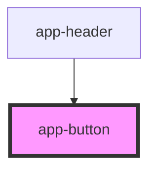

# app-button

<!-- Auto Generated Below -->

## Properties

| Property   | Attribute   | Description | Type     | Default     |
| ---------- | ----------- | ----------- | -------- | ----------- |
| `iconPath` | `icon-path` |             | `string` | `undefined` |
| `text`     | `text`      |             | `string` | `undefined` |

## Events

| Event          | Description | Type                |
| -------------- | ----------- | ------------------- |
| `loginClicked` |             | `CustomEvent<void>` |

## Dependencies

### Used by

 - [app-header](../my-component)

### Graph

----------------------------------------------

*Built with [StencilJS](https://stenciljs.com/)*
